# Проект представляет собой автоматизацию тестовых сценариев на примере онлайн магазина спортивных товаров primekraft.ru<br>

> primekraft.ru — онлайн магазин спортивных товаров основанный в г.Санкт-Петербург,<br>преимущество primekraft - собственное производство, которое ничем не хуже западных аналогов, а возможно даже и лучше.

## Содержание:
- [Использованный стек технологий](#computer-использованный-стек-технологий)
- [Запуск автотестов](#arrow_forward-Запуск-автотестов)
- [Сборка в Jenkins](#-Сборка-в-Jenkins)
- [Пример Allure-отчета](#-Пример-Allure-отчета)
- [Интеграция с Allure-TestOps](#-Интеграция-с-Allure-TestOps)
- [Интеграция с Jira](#-Интеграция-с-Jira)
- [Уведомления в Telegram с использованием бота](#-Уведомления-в-Telegram-с-использованием-бота)
- [Видео примера запуска тестов в Selenoid](#-видео-примера-запуска-теста-в-Selenoid)

## Использованный стек технологий

<p align="center">


</p>

- В данном проекте автотесты написаны на языке <code>Java</code> с использованием фреймворка для тестирования Selenide. 
- В качестве сборщика был использован - <code>Gradle</code>.  
- Использованы фреймворки <code>JUnit 5</code> и [Selenide](https://selenide.org/).
- При прогоне тестов браузер запускается в [Selenoid](https://aerokube.com/selenoid/).
- Для удаленного запуска реализована джоба в <code>Jenkins</code> с формированием Allure-отчета<br>и отправкой результатов в <code>Telegram</code> при помощи бота. 
- Осуществлена интеграция с <code>Allure TestOps</code> и <code>Jira</code>

Содержание Allure-отчета:
* Шаги теста;
* Скриншот страницы на последнем шаге;
* Page Source;
* Логи браузерной консоли;
* Видео выполнения автотеста.

## Запуск автотестов

### Возможнный запуск тестов из терминала
```
gradle clean test
gradle clean search_test
gradle clean shopCart_test
gradle clean catalog_test
gradle clean smoke_test
```
При выполнении команд, тесты запустятся удаленно в <code>Selenoid</code>.


При необходимости также можно переопределить параметры запуска
```
clean
${TASK}
"-Dbrowser=${BROWSER}"
"-DbrowserVersion=${BROWSER_VERSION}"
"-DbrowserSize=${BROWSER_SIZE}"
"-DbaseUrl=${BASE_URL}"
"-DremoteDriverUrl=https://user1:1234@${REMOTE_URL}/wd/hub/"
```

### Параметры сборки

* <code>BROWSER_NAME</code> – браузер, в котором будут выполняться тесты. По-умолчанию - <code>chrome</code>.
* <code>BROWSER_VERSION</code> – версия браузера, в которой будут выполняться тесты. По-умолчанию - <code>99.0</code>.
* <code>BROWSER_SIZE</code> – размер окна браузера, в котором будут выполняться тесты.
* <code>BASE_URL</code> – Url, по которому будет открываться тестируемое приложение. По-умолчанию - <code>1920x1080</code>.
* <code>REMOTE_BROWSER_URL</code> – адрес удаленного сервера, на котором будут запускаться тесты.
  
## Попробовать можно здесь 👉🏻 <a href='https://jenkins.autotests.cloud/job/primekraft_tests/build'>собрать<a>

##  Сборка в Jenkins 
<p align="center">
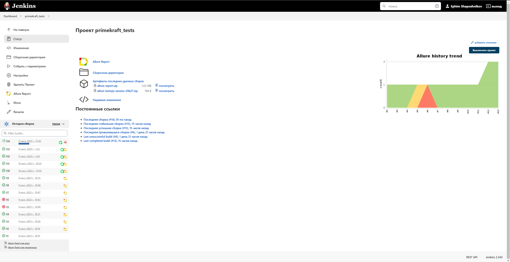
</p>

##  Пример Allure-отчета
### Overview

<p align="center">
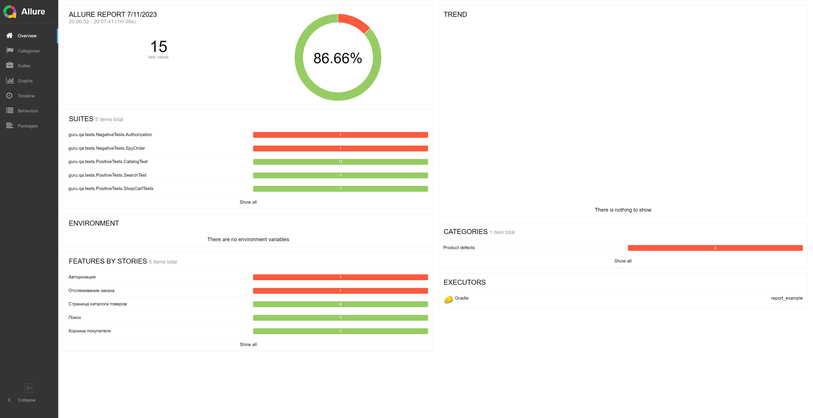
</p>

### Тест-кейсы

<p align="center">
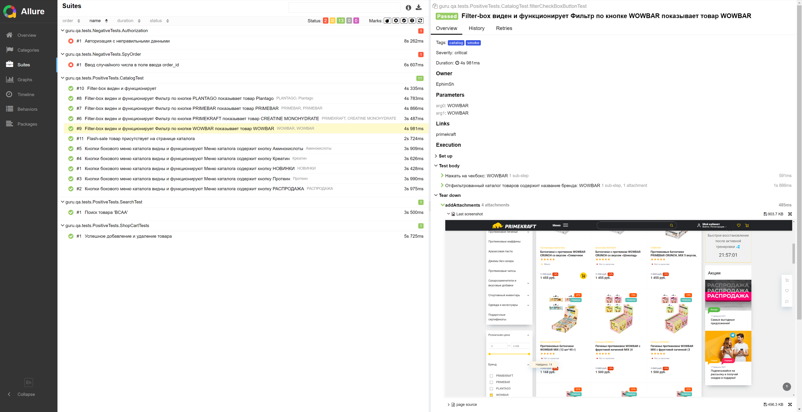
</p>

<p align="center">
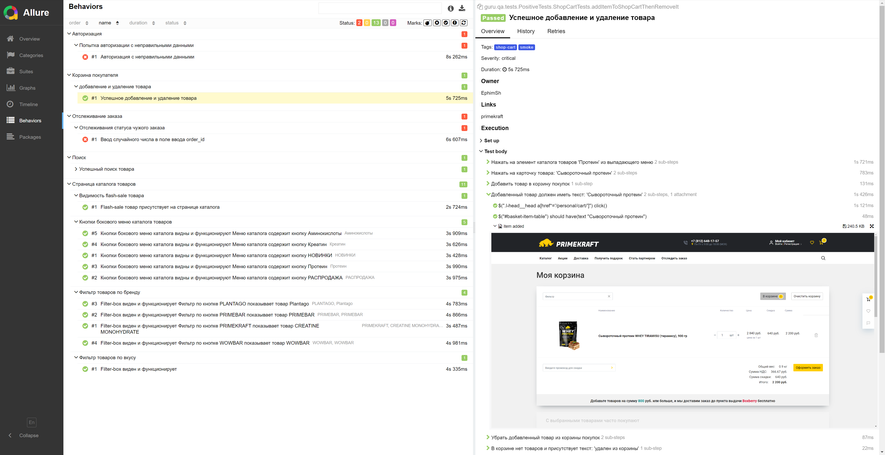
</p>

### Графики

<p align="center">
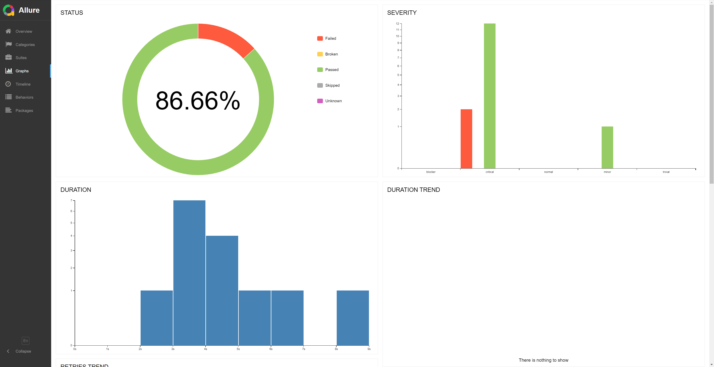
</p>

##  Интеграция с Allure TestOps

Выполнена интеграция сборки <code>Jenkins</code> с <code>Allure TestOps</code>.<br>
Результат выполнения автотестов отображается в <code>Allure TestOps</code><br>
На Dashboard в <code>Allure TestOps</code> отображена статистика пройденных тестов.

### Dashboard
<p align="center">
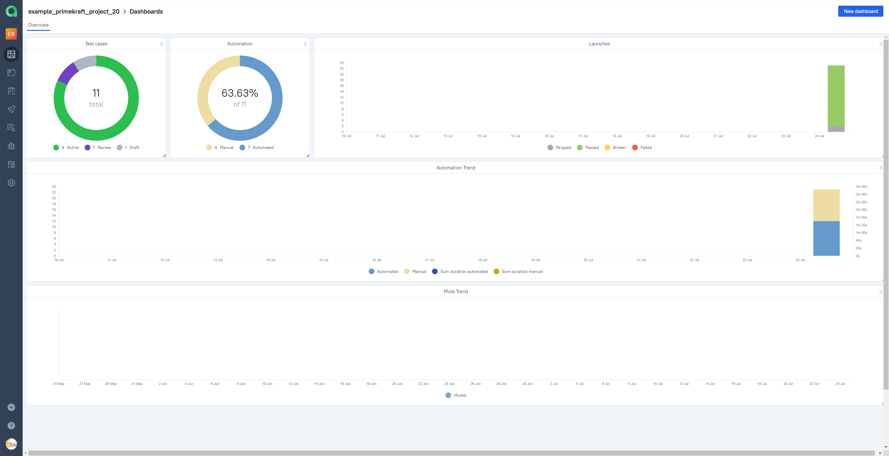
</p>

### Тест-кейсы
<p align="center">
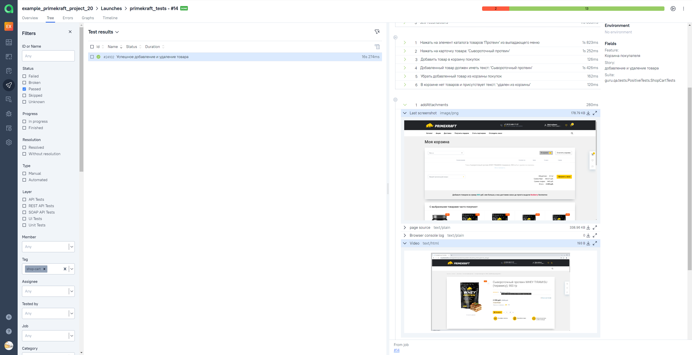
</p>
<p align="center">
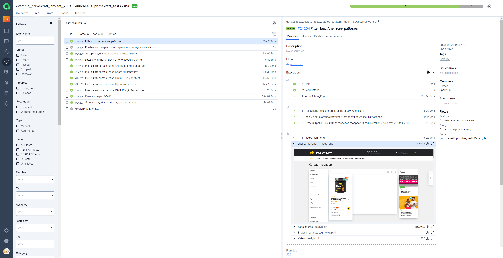
</p>


##  Интеграция с Jira

Реализована интеграция <code>Allure TestOps</code> с <code>Jira</code>, в тикете отображается информация, какие тест-кейсы были написаны в рамках задачи и результат их прогона.

<p align="center">
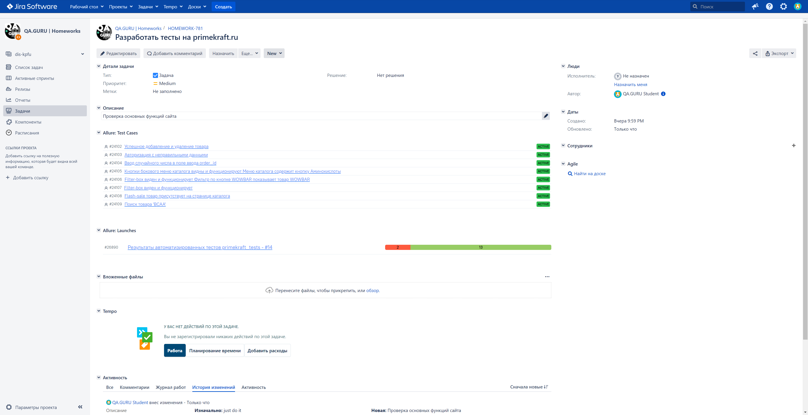
</p>

##  Уведомления в Telegram с использованием бота

После завершения сборки, бот созданный в <code>Telegram</code>, автоматически обрабатывает и отправляет сообщение с результатом.

<p align="center">
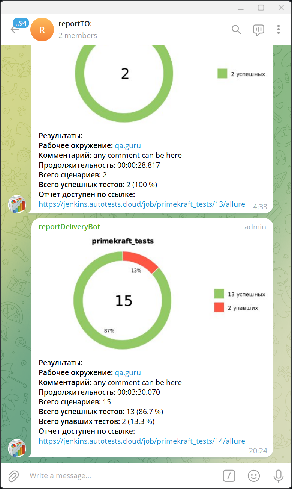
</p>

## Видео примера запуска тестов в Selenoid

К каждому тесту в отчете прилагается видео прогона.
<p align="center">
  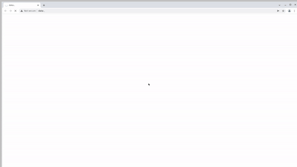
</p>
